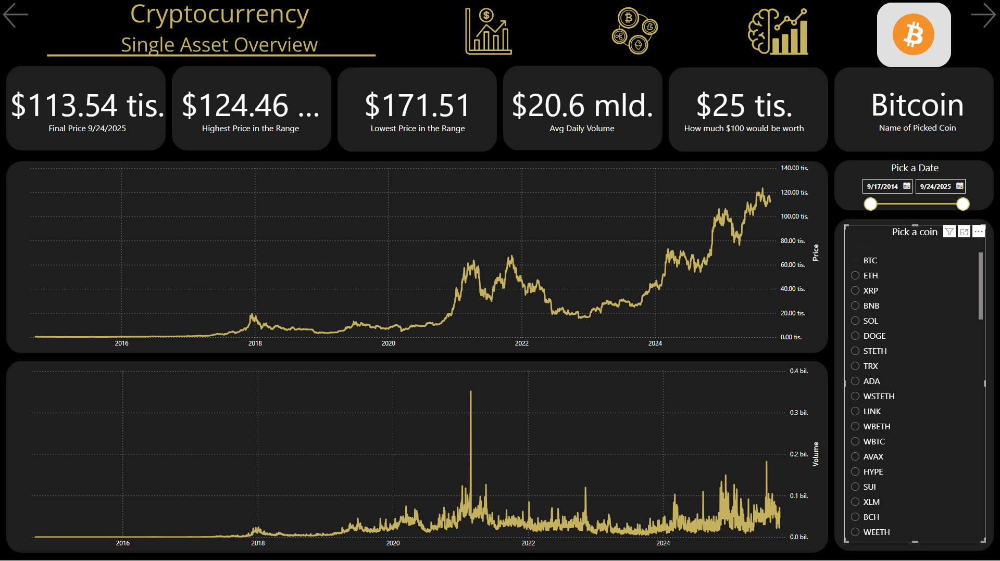
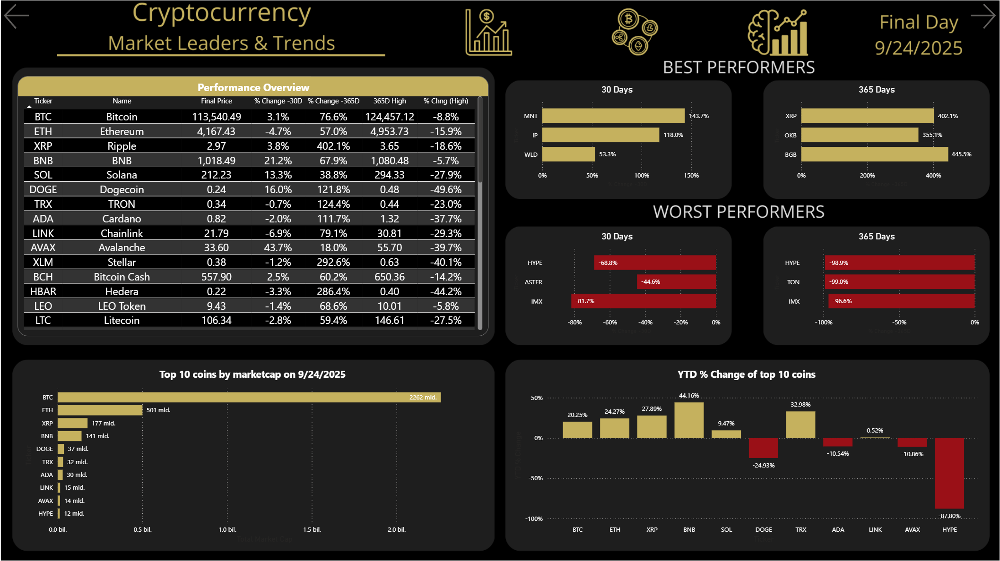
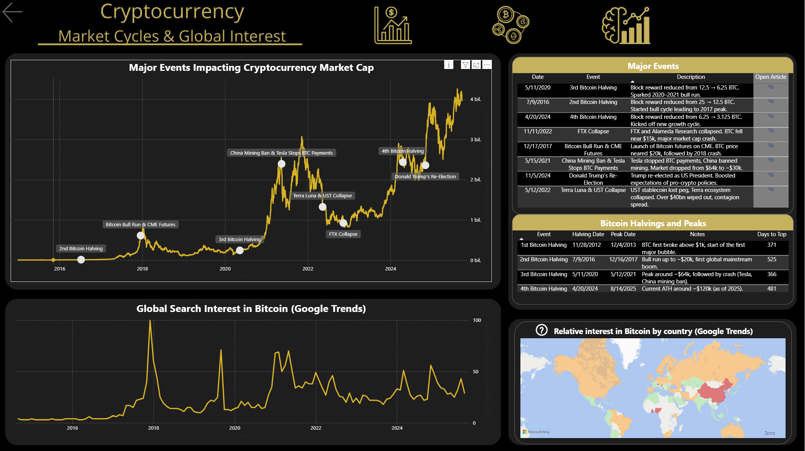

# 📊 Cryptocurrency Market Overview

Power BI dashboard zaměřený na přehled trhu s kryptoměnami, jejich kapitalizaci a vývoj v čase. Projekt slouží jako ukázka práce s daty, vizualizacemi a interaktivními prvky v Power BI.

---

## 🚀 Obsah projektu
- Přehled celkové **market capitalization** kryptoměn
- Vývoj hodnoty v čase (časová řada)
- Porovnání vybraných kryptoměn
- Klíčové události a jejich vliv na trh
- Interaktivní prvky: slicery, filtrování, navigace

---

## 🛠️ Použité technologie
- **Power BI Desktop**
- **Power Query** (čištění a příprava dat)
- **DAX** (výpočty, metriky)
- Dataset: veřejně dostupné zdroje ([Kaggle](https://www.kaggle.com/datasets/isaaclopgu/cryptocurrency-historical-prices-top-100-2025), CoinGecko)

---

## 📷 Ukázka dashboardu

1️⃣ Hlavní přehled / Home Overview

  - Úvodní stránka dashboardu s navigačními tlačítky na jednotlivé sekce (Single Asset Overview, Market Leaders & Trends, Market Cycles & Global Interest).

 

2️⃣ Jednotlivé aktivum / Single Asset Overview

  - Detailní přehled jedné kryptoměny – cena, tržní kapitalizace, objem obchodů, grafy vývoje ceny a objemu, jakou hodnotu by měla investice 100$ za zvolené období.
 
 

3️⃣ Tržní lídři a trendy / Market Leaders & Trends

  - Přehled nejvýkonnějších a nejslabších kryptoměn, tabulka top coinů podle kapitalizace a výkonnosti.
    

4️⃣ Tržní cykly a globální zájem / Market Cycles & Global Interest

  - Analýza tržních cyklů a hlavních událostí, které ovlivnily kryptoměnový trh. Vizualizace dopadů událostí na celkovou kapitalizaci. Počet dnů mezi halvingem a nejvyšší cenou.
    

  
